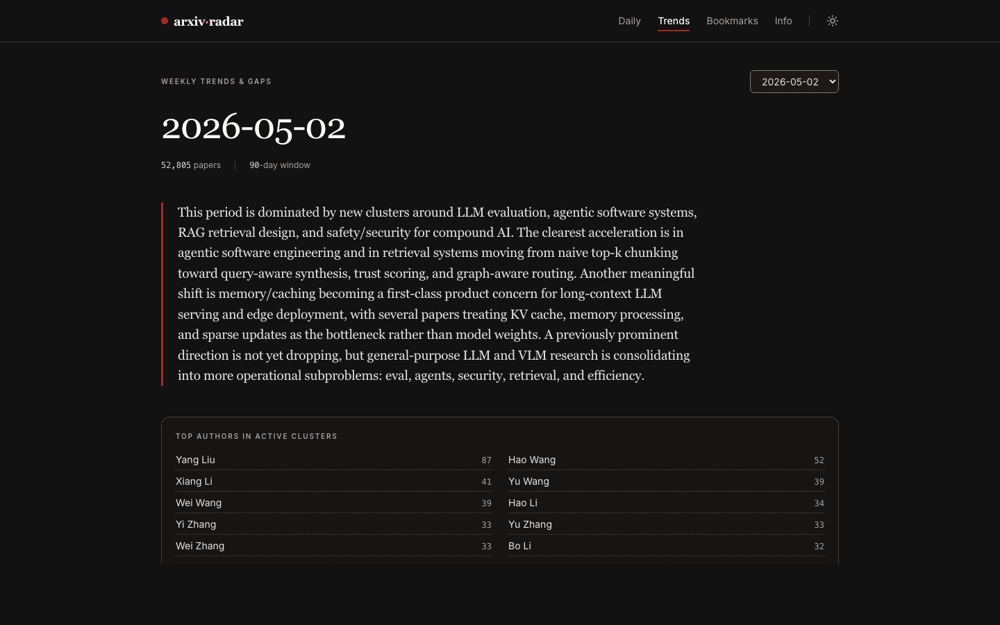

# arxiv-trend-radar



Live: [arxiv-trend-radar.vercel.app](https://arxiv-trend-radar.vercel.app)

Pulls research papers from arXiv every day and produces:

- **Daily briefing** — a short summary of the day's papers and a list of which ones are worth reading.
- **Weekly trend report** — groups of related papers from the past 90 days, noting which directions are growing and where research and industry don't match up yet.

## How it works

A GitHub Actions cron job pulls new papers from arXiv each morning across machine learning, computer vision, robotics, security, hardware architecture, distributed systems, signal processing, and quantitative finance. Each paper is converted to a vector embedding. An OpenAI call writes the daily briefing. Once a week, KMeans clusters the last 90 days of papers and a separate call writes the trend report. The React frontend reads the resulting JSON files.

## Stack

Python in GitHub Actions, OpenAI (embeddings + summaries), scikit-learn (clustering), React + TypeScript + Vite + Tailwind on Vercel.

## PWA (Install + Offline)

This app is installable and works offline for pages/data you already opened.

- `public/manifest.webmanifest` defines install metadata and icons.
- `public/sw.js` handles caching:
  - app shell: network-first with cache fallback
  - `/data/*`: stale-while-revalidate
  - icons/images: cache-first
- service worker registration is in [`src/main.tsx`](./src/main.tsx) and only runs in production builds.

### Install

- iOS Safari: Share -> Add to Home Screen
- Android Chrome: browser menu -> Install app / Add to Home screen
- Desktop Chrome/Edge: Install icon in address bar

### Local verification

```bash
npm install
npm run build
npm run preview
```

Open the preview URL, load Daily/Trends once, then go offline in DevTools and refresh. The app shell and previously viewed data should still render.

If you change service-worker behavior, bump `VERSION` in [`public/sw.js`](./public/sw.js) to force a new cache namespace.

## License

All rights reserved. See [LICENSE](./LICENSE).
